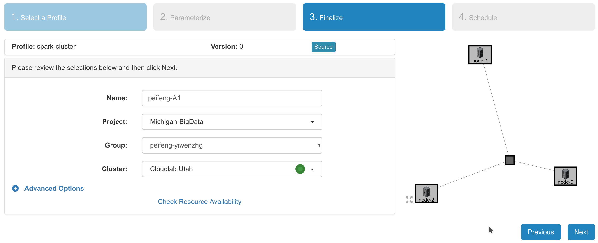

# EECS598 Assignment 0: Using CloudLab

In EECS598, you will do your assignments on CloudLab.
CloudLab is a research facility which provides bare-metal access and control over a substantial set of computing, storage, and networking resources.
If you haven't worked in CloudLab before, you need to [register a CloudLab account](https://cloudlab.us/signup.php).

This *non*assignment walks you through the CloudLab registration process and shows you how to start an experiment in CloudLab.

*Most importantly, it introduces our policies on using CloudLab that will be enforced throughout the semester.*

## Register A CloudLab Account

- To register an account, please use your **UMich email account and unique name**.
- Generate or use an existing SSH key, upload the public Key file which will be used by CloudLab nodes to identify you.
- Select `Join Existing Project` on the right column and enter `Michigan-BigData` as the project name.
- Click on `Submit Request`. You will get an email notificaiton after we approve your request. You will be assigned to a subgroup in the project based on your team.

NOTE: If you already have a CloudLab account, simply request to join the `Michigan-BigData` project.

## Start An Experiment

- To start a new experiment, go to your CloudLab dashboard and click on the `Experiments` tab in the upper left corner, then select `Start Experiment`. This will lead to the profile selection panel.
- Click on `Change Profile`, and select a profile from the list. For example, in Assignment 1, you will select the `spark-cluster` profile in the `Michigan-BigData` project. Select the profile and click on `Next` to move to the next panel.
- Name your experiment as `<uniqueNameOfTheStarter>-meaningfulText`.
- Make sure project is `Michigan-BigData`, and group is your assigned group.
- You also need to specify from which cluster you want to start your experiment. Each cluster has different hardwares. For more information on the hardware CloudLab provides, please refer to this [page](http://docs.cloudlab.us/hardware.html).
- Once the experiment is up and running, go to the "List View" of nodes and you can find the needed SSH command to log into the nodes.

## Persistent Storage

Data will be erased when the experiment stops, therefore do **NOT** store any important data without backup on those nodes.

However there is an exception to the above rule.
For each group, there is a designated location at
 `/groups/michigan-bigdata-PG0/<group_name>`, which will be persistent across experiments. You can store miscellaneous files here. Only group members have  access to it.

**Note**: there is a space limit on the directory, so do not store extra large data files.

## Policies on Using CloudLab Resources

The nodes you receive from CloudLab are real hardware machines sitting in different clusters. Therefore, we ask you not to hold the nodes for too long. CloudLab gives users 16 hours to start with, and users can extend it for a longer time. Manage your time efficiently and only hold onto those nodes when you are working on the assignment. You should use a private git repository to manage your code, and you must terminate the nodes when you are not using them. If you do have a need to extend the nodes, do not extend them by more than 1 day. **We will terminate any cluster running for more than 48 hours.**
